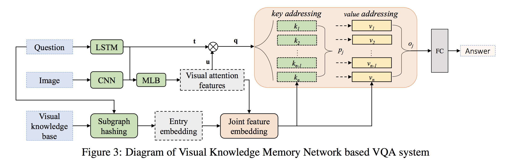
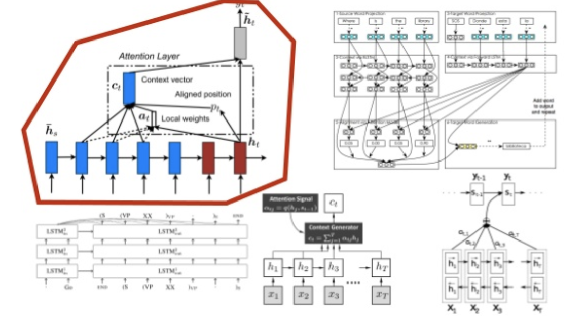

# Learning Visual Knowledge Memory Networks for Visual Question Answering

```
conf: CVPR 2018
author: Zhou Su, Chen Zhu, Yinpeng Dong, Dongqi Cai, Yurong Chen, Jianguo Li
```

## 概要

視覚的な質問を応答（VQA）するためには、画像だけでなく、自然言語を合わせた理解が必要になる。さらにVQAのためには、視覚的内容から、構造化された人間の知識を元に推論することが必要になる。

この論文では、この構造化された人間の知識とメモリーネットワークにおける深い視覚的特徴をend-to-end learning frameworkで解決する。これをVKMNとする。visual knowledge memory network

この論文では、既存手法の問題であった。２つの問題点を説明する。

ひとつは、visual contentを事実と統合する方法。 VKMNは、ナレッジトリプル（サブジェクト、リレーション、ターゲット）と深いビジュアルフィーチャをビジュアルナレッジフィーチャに組み込むことでこの問題を処理します。VKMNは、複数の事実を扱い易いように、メモリネットワークにキーと値のペア構造を使用してジョイント埋め込みを格納します。

もう一つは、次に、質問と回答のペアから広がる複数の知識の事実を処理するメカニズムです。

既存手法における問題VKMNにて解決する

----

introduction

現在CNNとRNNを組み合わせることが多く、attentionも組み込まれることも検討される

 これには視覚の注意[46,44,35]が含まれています。ここではどこを見ているかを問題に対処することに焦点を当て、問題の解決に焦点を当てた注意[33,47,11,26]に質問します。 画像と質問は2つの異なるモダリティであるため、2つのモダリティを共同して埋め込み、画像/質問のペアを統一的に記述することは簡単です。 いくつかの研究[14,19,20,50,48]では、アテンションメカニズムとマルチモーダルジョイントを1つの統一されたフレームワークに組み込むことを検討しています。


 しかし、VQAは、明示的な情報（オブジェクト、属性、画像キャプションなどの中間レベルの認識結果）が正確なVQAには不十分であるため、画像キャプションなどの他のビジョンや言語タスクよりもかなり複雑です。

 基本的には、VQAの質問目的を3つのカテゴリに分類することができます。（a）質問画像で回答する見かけの目的を認識結果（オブジェクト、属性、キャプションなど）から直接得ることができます。 （b）照会イメージでは、回答のターゲットが通常は小さすぎるか不明確であるため、正解のための事実をサポートする必要があります。 （c）イメージの内容に関する常識、トピック特有の、または百科事典の知識の控除を必要とする不可視の目的。

 特にcは、知識が必要になる。bもオーブンで何を焼くのかという知識が必要になる。


`手法のキモ`
 最近では、正確なQAのために、文書読みとりと知識ベース検索を組み合わせるためのメモリネットワークが提案されている[41、29、36]。本稿では、メモリネットワークベースのテキストQA手法の開発に着想を得て、あらかじめ構築された視覚知識ベースによる正確な推論のための視覚知識記憶ネットワーク（VKMN）を提案する。図2は、提案されたVKMNモデルが視覚的質問応答にどのように作用するかを示している。 VKMNは、質問から複数
 の関連する知識の事実を抽出し、視覚的な注意深い特徴と知識の事実を視覚的な注意深い特徴に組み込み、メモリから簡単かつ効率的に読むためにそれらをキーと値のペアに格納する。メモリの読みは、関連性の高い/関連する知識の事実に視覚的な質問を加えるので、より正確な質問の回答が得られます。

 

 （1）VKMNは、現在の知識ベースの解決法の知識の不正確さの制限を回避しつつ、注意ベースの方法および結合埋め込みベースの方法からメリットを継承する、単純で効率的なエンドツーエンドの訓練可能なフレームワークを提案する。 （2）私たちは、Freebase [7]のような一般知識ベースとして無関係な知識項目を含まない、視覚的に問題のある知識ベースを構築する。 （3）VQA v1.0とv2.0のベンチマークデータセットについて広範な実験を行い、提案手法が競合精度を達成する一方で、知識発見関連の最先端手法を上回る性能を示すことを示す。


 --------


 related

 attentionモデルでどこを見るべきか

 All these methods only involve one supporting knowledge fact to help the decision, so that they suffer greatly from the knowledge inaccuracy problem due to the inaccurate extraction procedure. This paper tries to alleviate this issue with memory network mechanism to handle multiple knowledge facts expanding from questions.
不正確な抽出手順に起因する知識の不正確さの問題から大きく苦しんでいます。本稿では、この問題をメモリネットワークメカニズムで解消し、質問から拡大していく複数の知識の事実を扱うことを試みる。


-----------

Methods




## 概論
視覚的な質問応答タスクに対して、VKMN（Visual Knowledge Memory Network）を提案する。VKMNは、構造化された人間の知識（KB）とメモリーネットワークをend-to-endな構造にしたフレームワークである。

## 新規性・結果・なぜ通ったか
実験により、VQA v1.0とv2.0の両方のベンチマークで有望な結果が得られ、知識推論関連の問題について最先端の手法を上回ることが示された。

## コメント
http://openaccess.thecvf.com/content_cvpr_2018/papers/Su_Learning_Visual_Knowledge_CVPR_2018_paper.pdf

## 先行研究と比べてどこがすごい？
ビジュアルコンテンツと人間の知識を統合する点、質問と回答のペアから複数の事実を処理する点

## 技術や手法のキモはどこ？

## 議論はある？
## 次に読むべき論文は？


## 事前知識

- VQA
- アテンション
- メモリーネットワーク

### VQAについて
`解説`
https://www.mi.t.u-tokyo.ac.jp/research/vqa/

`データ・セット`
http://www.visualqa.org/


### アテンション

[Deep Learning で使われてる attention ってやつを調べてみた](http://ksksksks2.hatenadiary.jp/entry/20160430/1462028071)

>入力情報全体ではなく、その一部のみを特にフォーカスしたベクトルをデコーダーで使用する仕組みのことです。そのことにより、デコードの特定のタイミングにだけ必要になる入力情報を精度よく出力に反映させることができるようになります。

[最近のDeep Learning (NLP) 界隈におけるAttention事情](https://www.slideshare.net/yutakikuchi927/deep-learning-nlp-attention)



### メモリーネットワーク

[Memory Networks (End-to-End Memory Networks の Chainer 実装)](https://www.slideshare.net/shuyo/memory-networks-endtoend-memory-networks-chainer)

コンピュータにおけるメモリのように、知識を記憶するネットワーク

####
